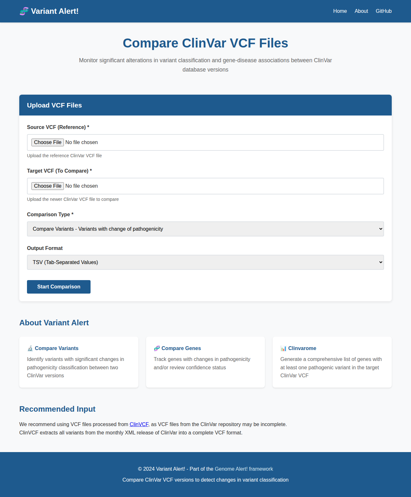

# Variant Alert! Web Interface

A user-friendly web interface for Variant Alert!, providing an easy way to compare ClinVar VCF files without using the command line.



## Features

- 🌐 **Web-based Interface**: Upload and compare VCF files through your browser
- 📊 **Multiple Comparison Types**: 
  - Compare Variants: Identify variants with pathogenicity changes
  - Compare Genes: Track gene-disease association changes
  - Clinvarome: Generate pathogenic gene lists
- 📥 **Easy Downloads**: Download results directly from the browser
- 🎨 **Responsive Design**: Works on desktop and mobile devices

## Installation

### Prerequisites

- Python >= 3.6
- Poetry (recommended) or pip

### Install Dependencies

#### Using Poetry:
```bash
cd /home/runner/work/variant_alert/variant_alert
poetry install
```

#### Using pip:
```bash
pip install flask werkzeug
```

## Running the Web Interface

### Method 1: Using Poetry (Recommended)

```bash
poetry run variant-alert-web
```

### Method 2: Direct Python

```bash
python web/app.py
```

### Method 3: Using Flask Command

```bash
export FLASK_APP=web/app.py
flask run --host=0.0.0.0 --port=5000
```

The web interface will be available at: `http://localhost:5000`

## Usage

1. **Open the web interface** in your browser
2. **Upload VCF files**:
   - Source VCF: The reference/older ClinVar VCF file
   - Target VCF: The newer ClinVar VCF file to compare
3. **Select comparison type**:
   - Compare Variants (supports TSV or VCF output)
   - Compare Genes
   - Clinvarome
4. **Click "Start Comparison"** and wait for processing
5. **Download results** when ready

## API Endpoints

The web interface provides the following API endpoints:

- `GET /` - Main web interface
- `GET /about` - About page
- `POST /api/compare` - Submit comparison job
- `GET /api/download/<session_id>/<filename>` - Download result file
- `GET /health` - Health check endpoint

## Configuration

The web interface can be configured by modifying `web/app.py`:

- `MAX_FILE_SIZE`: Maximum upload file size (default: 100MB)
- `UPLOAD_FOLDER`: Directory for uploaded files
- `OUTPUT_FOLDER`: Directory for result files

## Security Considerations

- File uploads are sanitized using `secure_filename()`
- Session IDs are validated to prevent directory traversal
- File size limits are enforced
- Temporary files are stored in separate session directories

## Docker Deployment

A Dockerfile is provided for containerized deployment:

```bash
docker build -t variant-alert-web .
docker run -p 5000:5000 variant-alert-web
```

## Production Deployment

For production use, it's recommended to:

1. Use a production WSGI server (e.g., Gunicorn, uWSGI)
2. Set up a reverse proxy (e.g., Nginx)
3. Enable HTTPS
4. Implement user authentication if needed
5. Set up monitoring and logging

Example with Gunicorn:

```bash
poetry run gunicorn -w 4 -b 0.0.0.0:5000 web.app:app
```

## Troubleshooting

### Port Already in Use
If port 5000 is already in use, you can specify a different port:

```bash
python web/app.py --port 8080
```

### Large File Uploads
For very large VCF files, you may need to increase the timeout and file size limits in your web server configuration.

### Memory Issues
Processing large VCF files may require significant memory. Ensure your system has adequate RAM available.

## Support

For issues and questions, please visit:
- GitHub: https://github.com/xukrutdonut/variant_alert
- Documentation: See main README.md

## License

Apache License 2.0 - See LICENSE file for details
